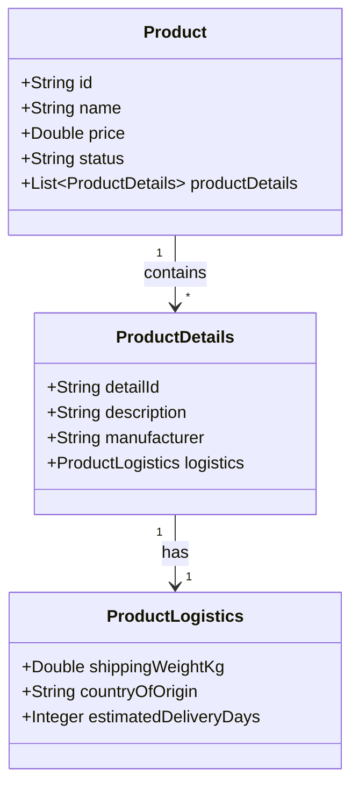
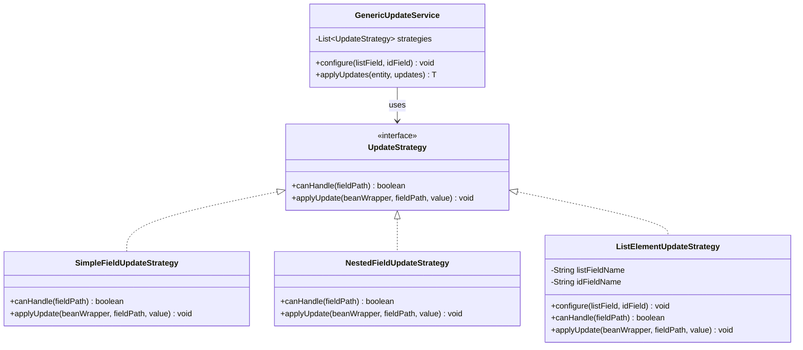
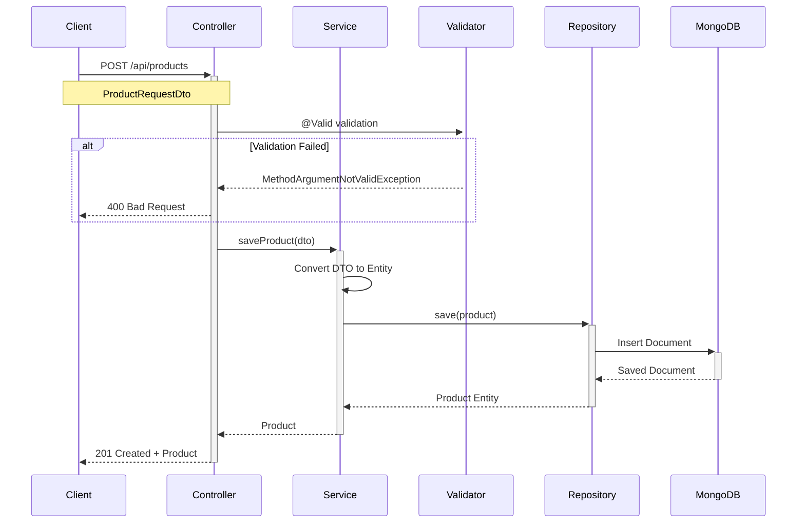
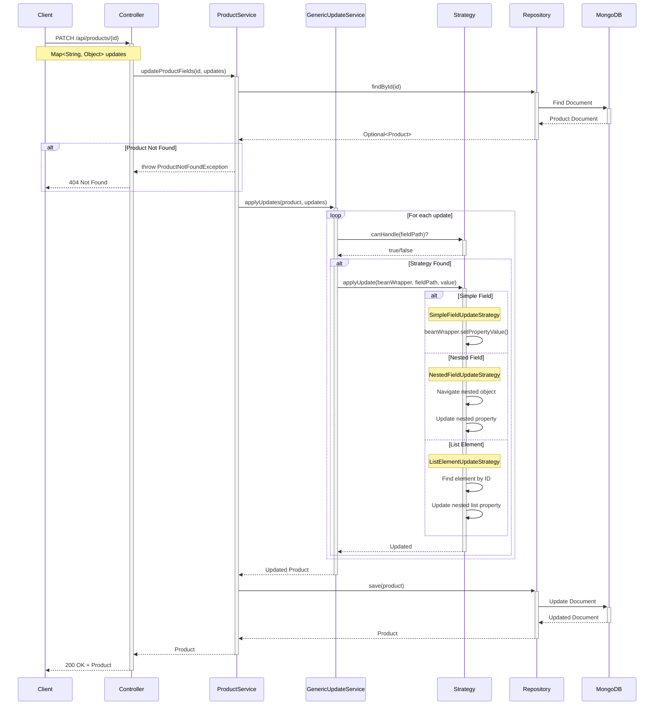
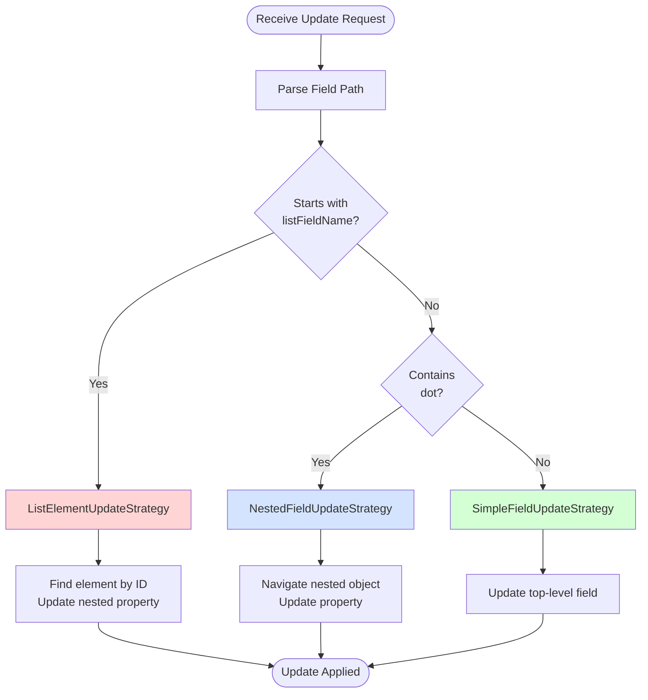

# MongoDB 3-Level Nested Collections Demo

Production-ready Spring Boot application demonstrating:
- CRUD operations on Product documents stored in MongoDB
- 3-level nested collections (Product → List<ProductDetails> → ProductLogistics)
- Strategy Pattern for dynamic partial updates
- Projection queries (fetching only selected fields)
- Storing only fields with values (cleans empty/blank fields before save)
- Deep updates into list elements using unique ID

## Architecture Overview

```mermaid
graph TB
    subgraph "Client Layer"
        REST[REST Client]
    end
    
    subgraph "Controller Layer"
        PC[ProductController<br/>@RestController]
    end
    
    subgraph "Service Layer"
        PS[ProductService]
        GUS[GenericUpdateService<br/>Strategy Pattern]
    end
    
    subgraph "Strategy Layer"
        SFS[SimpleFieldUpdateStrategy]
        NFS[NestedFieldUpdateStrategy]
        LES[ListElementUpdateStrategy]
    end
    
    subgraph "Repository Layer"
        PR[ProductRepository<br/>MongoRepository]
    end
    
    subgraph "Database Layer"
        MONGO[(MongoDB)]
    end
    
    REST --> PC
    PC --> PS
    PS --> GUS
    PS --> PR
    GUS --> SFS
    GUS --> NFS
    GUS --> LES
    PR --> MONGO
    
    style GUS fill:#e1f5ff
    style SFS fill:#d4edda
    style NFS fill:#d4edda
    style LES fill:#d4edda
```

## Data Model

### 3-Level Nested Structure



## Strategy Pattern Architecture



## API Endpoints

### Create Product



### Update Product Fields (Strategy Pattern)



## Strategy Selection Flow



## Exception Handling Flow

```mermaid
flowchart TD
    Request([API Request]) --> Controller[Controller Method]
    Controller --> Validation{@Valid<br/>Validation}
    
    Validation -->|Failed| MVE[MethodArgumentNotValidException]
    Validation -->|Passed| Service[Service Layer]
    
    Service --> Business{Business<br/>Logic}
    
    Business -->|Not Found| PNF[ProductNotFoundException]
    Business -->|Invalid Update| IUE[InvalidUpdateException]
    Business -->|Validation Error| VE[ValidationException]
    Business -->|Illegal Argument| IAE[IllegalArgumentException]
    Business -->|Unknown Error| GE[Generic Exception]
    Business -->|Success| Success([200 OK])
    
    MVE --> Handler[GlobalExceptionHandler]
    PNF --> Handler
    IUE --> Handler
    VE --> Handler
    IAE --> Handler
    GE --> Handler
    
    Handler --> Response{Exception<br/>Type}
    
    Response -->|MVE| R400A[400 Bad Request<br/>Validation errors]
    Response -->|PNF| R404[404 Not Found<br/>Resource not found]
    Response -->|IUE/VE/IAE| R400B[400 Bad Request<br/>Error message]
    Response -->|GE| R500[500 Internal Server Error<br/>Generic error]
    
    R400A --> Client([Client])
    R404 --> Client
    R400B --> Client
    R500 --> Client
    Success --> Client
    
    style Handler fill:#fff3cd
    style R404 fill:#ffd4d4
    style R400A fill:#ffd4d4
    style R400B fill:#ffd4d4
    style R500 fill:#ffd4d4
    style Success fill:#d4ffd4
```

## Features

### ✅ Production-Ready Components

- **Exception Handling**: Global exception handler with custom exceptions
- **Input Validation**: Bean Validation with comprehensive rules
- **API Documentation**: Swagger/OpenAPI 3.0 with annotations
- **Logging**: SLF4J/Logback with file rotation
- **Strategy Pattern**: Extensible update mechanism
- **Error Responses**: Standardized ErrorResponse DTO

### 🔧 Technical Stack

- Java 21
- Spring Boot 3.4.5 (Web, Spring Data MongoDB)
- MongoDB (tested against local MongoDB)
- MapStruct + Lombok for DTO mapping
- Bean Validation (jakarta.validation)
- SpringDoc OpenAPI 3.0.0
- SLF4J + Logback
- Maven 3.8+

## Quick Start

### Prerequisites

- Java 21 JDK
- Maven 3.8+
- MongoDB 4.4+ (local or Docker)

### Default Configuration

```properties
spring.data.mongodb.uri=mongodb://localhost:27017/productdb
spring.data.mongodb.auto-index-creation=true
```

### Run Application

```bash
# Start MongoDB
docker run --name mongodb -p 27017:27017 -d mongo:7

# Build
mvn -U clean package

# Run
mvn spring-boot:run

# Override MongoDB URI
mvn spring-boot:run -Dspring-boot.run.arguments="--spring.data.mongodb.uri=mongodb://myhost:27017/productdb"

# Or with JAR
java -jar target/*.jar --spring.data.mongodb.uri=mongodb://myhost:27017/productdb
```

### Access Swagger UI

```
http://localhost:8080/swagger-ui.html
```

## API Endpoints Reference

### Base Path: `/api/products`

| Method | Endpoint | Description |
|--------|----------|-------------|
| POST | `/api/products` | Create product |
| GET | `/api/products` | Get all products |
| GET | `/api/products/{id}` | Get product by ID |
| GET | `/api/products/{id}/projected?fields=...` | Get product with projection |
| GET | `/api/products/projected?fields=...` | Get all products with projection |
| DELETE | `/api/products/{id}` | Delete product |
| PATCH | `/api/products/{id}/status` | Update status field only |
| PATCH | `/api/products/{id}` | Generic partial update |

## API Examples

### Create Product

```bash
curl -X POST http://localhost:8080/api/products \
  -H "Content-Type: application/json" \
  -d '{
    "name": "Example Widget",
    "description": "An example product",
    "price": 19.99,
    "category": "gadgets",
    "available": true,
    "tags": ["featured", "sale"],
    "manufacturer": "Acme",
    "modelNumber": "W-1000",
    "sku": "ACME-W1000",
    "status": "Active",
    "productDetails": [
      {
        "detailId": "DETAIL-1",
        "weight": "200g",
        "dimensions": "10x5x2",
        "color": "red",
        "material": "plastic",
        "logistics": {
          "shippingWeightKg": 0.2,
          "volumeCubicCm": "1000",
          "countryOfOrigin": "CN",
          "customsCode": "ABC123"
        }
      },
      {
        "detailId": "DETAIL-2",
        "weight": "300g",
        "dimensions": "12x6x3",
        "color": "blue",
        "material": "metal"
      }
    ]
  }'
```

### Get Product by ID

```bash
curl http://localhost:8080/api/products/{id}
```

### Projection Query (Selected Fields Only)

```bash
# Single product with projection
curl "http://localhost:8080/api/products/{id}/projected?fields=name,price,productDetails.color"

# All products with projection
curl "http://localhost:8080/api/products/projected?fields=name,price,status"
```

### Update Status Field Only

```bash
curl -X PATCH http://localhost:8080/api/products/{id}/status \
  -H "Content-Type: application/json" \
  -d '{"status": "Discontinued"}'
```

### Update Simple Field

```bash
curl -X PATCH http://localhost:8080/api/products/{id} \
  -H "Content-Type: application/json" \
  -d '{"name": "Updated Widget"}'
```

### Update Nested List Element Field

```bash
curl -X PATCH http://localhost:8080/api/products/{id} \
  -H "Content-Type: application/json" \
  -d '{"productDetails.DETAIL-1.color": "green"}'
```

### Update Deep Nested Field (3-Level)

```bash
curl -X PATCH http://localhost:8080/api/products/{id} \
  -H "Content-Type: application/json" \
  -d '{"productDetails.DETAIL-1.logistics.shippingWeightKg": 2.5}'
```

## Project Structure

```
mongo-demo-3-level-nested/
├── src/main/java/com/example/product/
│   ├── controller/
│   │   └── ProductController.java          # REST endpoints
│   ├── service/
│   │   ├── ProductService.java             # Business logic
│   │   └── GenericUpdateService.java       # Strategy Pattern coordinator
│   ├── strategy/
│   │   ├── UpdateStrategy.java             # Strategy interface
│   │   ├── SimpleFieldUpdateStrategy.java  # Top-level field updates
│   │   ├── NestedFieldUpdateStrategy.java  # Nested object updates
│   │   └── ListElementUpdateStrategy.java  # List element updates
│   ├── repository/
│   │   └── ProductRepository.java          # MongoDB repository
│   ├── model/
│   │   ├── Product.java                    # Main entity
│   │   ├── ProductDetails.java             # Nested entity (Level 2)
│   │   └── ProductLogistics.java           # Nested entity (Level 3)
│   ├── dto/
│   │   ├── ProductRequestDto.java          # Create/Update DTO
│   │   ├── ProductResponseDto.java         # Response DTO
│   │   ├── ProductDetailsRequestDto.java   # Nested DTO
│   │   └── ProductLogisticsRequestDto.java # Nested DTO
│   ├── mapper/
│   │   └── ProductMapper.java              # MapStruct mapper
│   ├── exception/
│   │   ├── GlobalExceptionHandler.java     # @RestControllerAdvice
│   │   ├── ProductNotFoundException.java
│   │   ├── InvalidUpdateException.java
│   │   ├── ValidationException.java
│   │   └── ErrorResponse.java              # Error DTO
│   └── config/
│       └── OpenApiConfig.java              # Swagger configuration
├── src/main/resources/
│   ├── application.properties              # MongoDB config
│   └── logback-spring.xml                  # Logging config
├── pom.xml                                 # Maven dependencies
├── VALIDATION.md                           # Validation rules
├── LOGGING.md                              # Logging guide
├── STRATEGY-PATTERN.md                     # Strategy Pattern guide
└── README.md                               # This file
```

## Documentation

- [VALIDATION.md](VALIDATION.md) - Input validation rules and examples
- [LOGGING.md](LOGGING.md) - Logging configuration and best practices
- [STRATEGY-PATTERN.md](STRATEGY-PATTERN.md) - Strategy Pattern implementation guide

## Key Concepts

### 3-Level Nested Updates

Supports deep updates using dot-path notation:
- **Format**: `productDetails.<detailId>.<nestedPath>`
- **Example**: `productDetails.DETAIL-1.logistics.shippingWeightKg`
- **Mechanism**: Identifies list element by unique `detailId`, then updates nested property

### Strategy Pattern Benefits

✅ **Single Responsibility** - Each strategy handles one update type  
✅ **Open/Closed** - Add new strategies without modifying existing code  
✅ **Testable** - Unit test each strategy independently  
✅ **Maintainable** - Clear separation of concerns

### Update Strategies

| Strategy | Handles | Example |
|----------|---------|---------|
| SimpleFieldUpdateStrategy | Top-level fields | `name`, `price`, `status` |
| NestedFieldUpdateStrategy | Nested objects | `metadata.version` |
| ListElementUpdateStrategy | List elements by ID | `productDetails.DETAIL-1.logistics.shippingWeightKg` |

### Partial-Saving Behavior

Before saving, `ProductService` runs `prepareProductForSave` to:
- Convert blank/empty strings to null
- Convert empty lists to null
- Clean nested ProductDetails and ProductLogistics
- Result: MongoDB stores only meaningful fields

## Error Responses

All errors return standardized JSON:

```json
{
  "timestamp": "2024-02-22T10:30:00",
  "status": 404,
  "error": "Not Found",
  "message": "Product not found with id: 123",
  "path": "/api/products/123"
}
```

## Validation Rules

- **name**: Required, 1-200 characters
- **price**: Required, minimum 0.01
- **status**: Required, matches ACTIVE|INACTIVE|DISCONTINUED
- **detailId**: Required, not blank
- **shippingWeightKg**: Minimum 0.01
- **countryOfOrigin**: 2-100 characters

See [VALIDATION.md](VALIDATION.md) for complete rules.

## Logging

- **Console**: All logs
- **File**: `logs/application.log` (10MB max, 30-day retention)
- **Error File**: `logs/error.log` (errors only)

See [LOGGING.md](LOGGING.md) for configuration.

## Sample Response

```json
{
  "id": "650b...",
  "name": "Example Widget",
  "price": 19.99,
  "status": "Active",
  "productDetails": [
    {
      "detailId": "DETAIL-1",
      "weight": "200g",
      "logistics": {
        "shippingWeightKg": 0.2,
        "volumeCubicCm": "1000",
        "countryOfOrigin": "CN",
        "customsCode": "ABC123"
      }
    }
  ]
}
```

## Key Features Summary

✅ **CRUD Operations** - Full create, read, update, delete support  
✅ **3-Level Nesting** - Product → ProductDetails → ProductLogistics  
✅ **Strategy Pattern** - Extensible update mechanism  
✅ **Projection Queries** - Fetch only required fields  
✅ **Partial Updates** - Update any field at any nesting level  
✅ **Clean Storage** - Only stores non-empty fields  
✅ **MapStruct + Lombok** - Automatic DTO mapping  
✅ **Production Ready** - Exception handling, validation, logging, API docs

